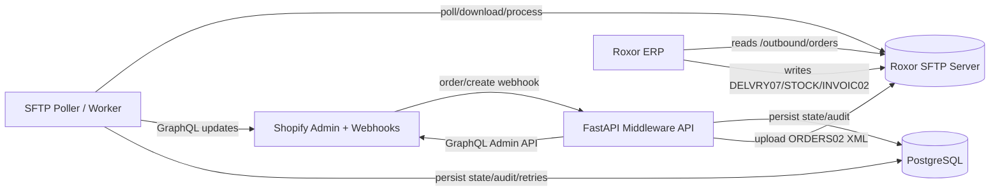
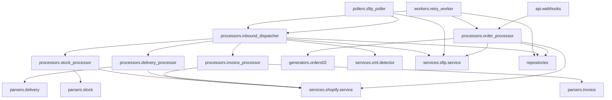
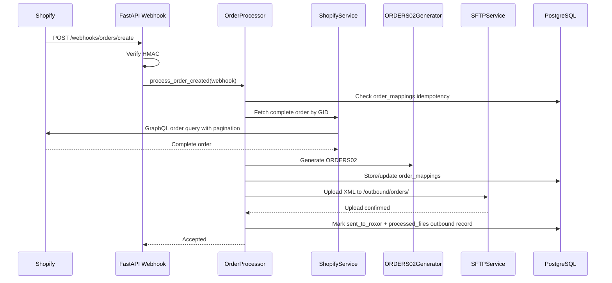
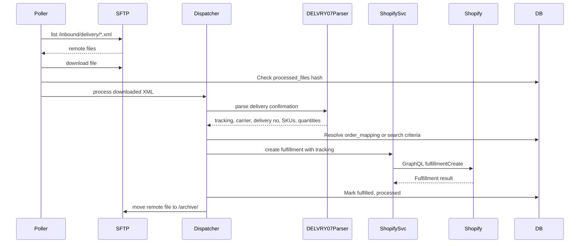
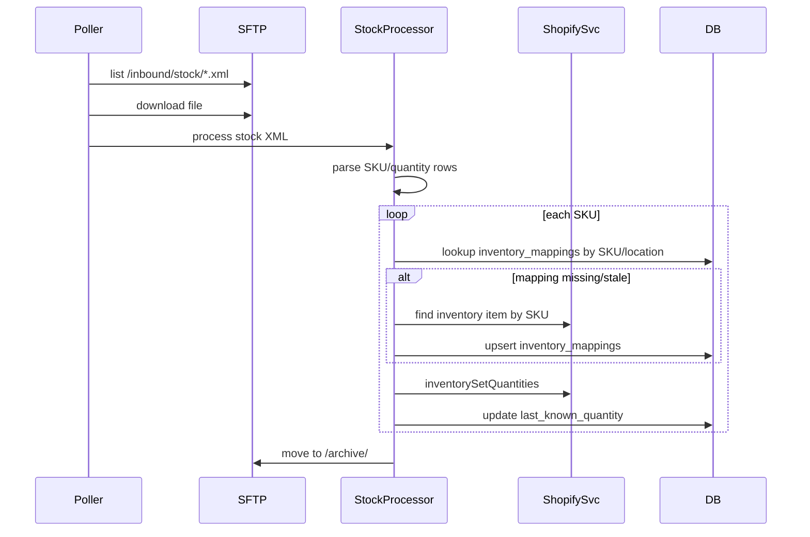
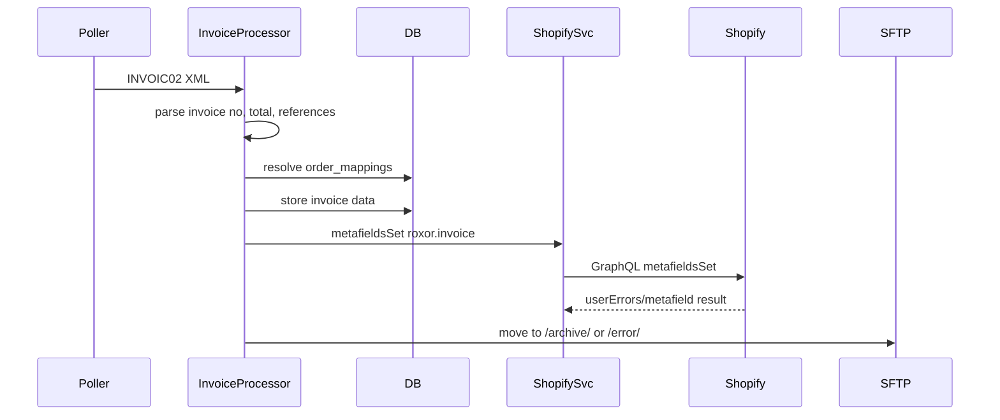
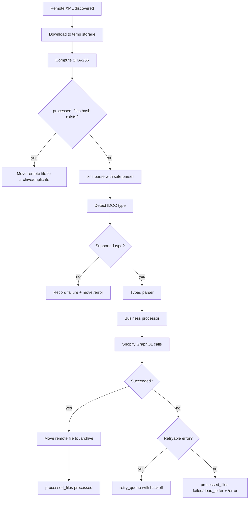
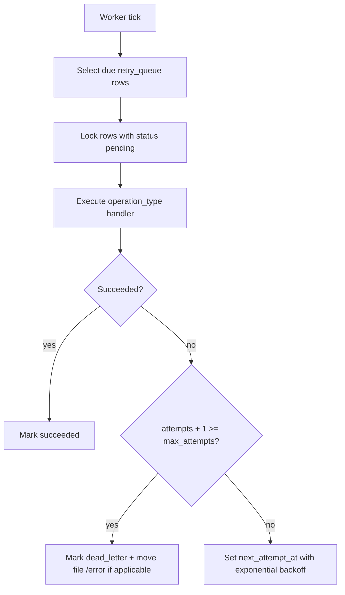
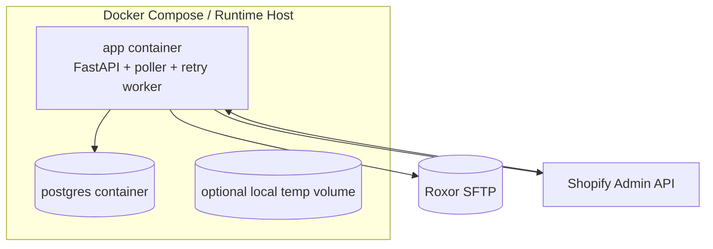

# Shopify ↔ Roxor ERP Middleware Architecture Plan

## 1. High-level architecture

The middleware is the integration boundary between Shopify and Roxor ERP. Roxor communication is **file-only over SFTP**; the middleware must not assume direct Roxor API access.



### Core responsibilities

| Component | Responsibility |
| --- | --- |
| FastAPI API | Health checks, Shopify webhook ingress, operational endpoints. |
| Shopify service | GraphQL Admin API queries/mutations, retries, rate-limit handling, pagination. |
| SFTP service | Paramiko connection lifecycle, upload/download/list/move/archive/delete. |
| XML services | IDOC type detection, schema-aware parsing, ORDERS02 generation, validation. |
| Processors | Business orchestration for orders, deliveries, stock, invoices. |
| Pollers/workers | 30-second SFTP polling loop and retry queue execution. |
| Repositories | Persistence boundary for idempotency, mappings, audit logs, retries. |
| PostgreSQL | Source of truth for processed files, retry state, order/inventory mappings, audit trails. |

## 2. Detailed folder structure

The implementation should be generated module-by-module using this structure:

```text
app/
├── api/
│   ├── __init__.py
│   ├── dependencies.py
│   ├── health.py
│   ├── webhooks.py
│   └── admin.py
├── config/
│   ├── __init__.py
│   ├── settings.py
│   └── logging.py
├── db/
│   ├── __init__.py
│   ├── base.py
│   ├── session.py
│   └── migrations.py
├── models/
│   ├── __init__.py
│   ├── processed_file.py
│   ├── integration_log.py
│   ├── order_mapping.py
│   ├── retry_queue.py
│   └── inventory_mapping.py
├── repositories/
│   ├── __init__.py
│   ├── processed_files.py
│   ├── integration_logs.py
│   ├── order_mappings.py
│   ├── retry_queue.py
│   └── inventory_mappings.py
├── services/
│   ├── __init__.py
│   ├── sftp/
│   │   ├── __init__.py
│   │   ├── client.py
│   │   ├── service.py
│   │   └── paths.py
│   ├── shopify/
│   │   ├── __init__.py
│   │   ├── client.py
│   │   ├── service.py
│   │   ├── queries.py
│   │   └── mutations.py
│   └── xml/
│       ├── __init__.py
│       ├── detector.py
│       ├── validator.py
│       └── canonical.py
├── parsers/
│   ├── __init__.py
│   ├── base.py
│   ├── delivery.py
│   ├── invoice.py
│   ├── orders_ack.py
│   └── stock.py
├── generators/
│   ├── __init__.py
│   └── orders02.py
├── processors/
│   ├── __init__.py
│   ├── inbound_dispatcher.py
│   ├── order_processor.py
│   ├── delivery_processor.py
│   ├── stock_processor.py
│   └── invoice_processor.py
├── pollers/
│   ├── __init__.py
│   └── sftp_poller.py
├── workers/
│   ├── __init__.py
│   ├── retry_worker.py
│   └── lifecycle.py
├── schemas/
│   ├── __init__.py
│   ├── idoc.py
│   ├── shopify.py
│   ├── retry.py
│   └── webhook.py
├── utils/
│   ├── __init__.py
│   ├── hashing.py
│   ├── time.py
│   ├── exceptions.py
│   └── security.py
├── logs/
│   └── __init__.py
└── main.py

tests/
├── unit/
├── parsers/
├── api/
├── services/
│   ├── test_shopify_service.py
│   └── test_sftp_service.py
└── processors/
```

## 3. Database schema

### 3.1 `processed_files`

Purpose: prevent duplicate XML processing and retain file lifecycle audit data.

| Column | Type | Notes |
| --- | --- | --- |
| id | bigint PK | Surrogate key. |
| filename | varchar(512) | Remote filename. |
| remote_path | varchar(1024) | Original SFTP path. |
| archive_path | varchar(1024), nullable | Final archive/error path. |
| file_hash | char(64), unique | SHA-256 of downloaded bytes. |
| idoc_type | varchar(32) | ORDERS02, ORDERS05, DELVRY07, INVOIC02, STOCK if agreed. |
| direction | enum | inbound_from_roxor, outbound_to_roxor. |
| status | enum | pending, processing, processed, failed, dead_letter. |
| retry_count | int | Processing retry count. |
| error_message | text, nullable | Last failure summary. |
| correlation_id | varchar(64) | Log correlation key. |
| first_seen_at | timestamptz | First detection. |
| processed_at | timestamptz, nullable | Completion time. |
| created_at / updated_at | timestamptz | Audit timestamps. |

Indexes:

- unique `file_hash`
- index `(status, first_seen_at)`
- index `(idoc_type, processed_at)`

### 3.2 `integration_logs`

Purpose: durable audit trail in addition to structured application logs.

| Column | Type | Notes |
| --- | --- | --- |
| id | bigint PK | Surrogate key. |
| correlation_id | varchar(64), indexed | Links all events for one file/order. |
| event_type | varchar(128) | sftp.list, xml.parse, shopify.fulfillment_create, etc. |
| level | varchar(16) | debug/info/warning/error/critical. |
| message | text | Human-readable summary. |
| context | jsonb | Structured event metadata. |
| duration_ms | int, nullable | Operation timing. |
| created_at | timestamptz | Event time. |

### 3.3 `order_mappings`

Purpose: correlate Shopify orders, Roxor references, dispatches, and invoices.

| Column | Type | Notes |
| --- | --- | --- |
| id | bigint PK | Surrogate key. |
| shopify_order_id | varchar(128), unique | GraphQL GID. |
| shopify_order_name | varchar(128), indexed | Human order number, e.g. #1001. |
| shopify_customer_id | varchar(128), nullable | Customer GID. |
| roxor_order_reference | varchar(128), indexed, nullable | Roxor/SAP order reference. |
| roxor_delivery_reference | varchar(128), nullable | Delivery document number. |
| invoice_number | varchar(128), nullable | ERP invoice number. |
| invoice_total | numeric(14,2), nullable | Invoice total. |
| invoice_currency | char(3), nullable | ISO currency. |
| status | varchar(64) | created, sent_to_roxor, acknowledged, fulfilled, invoiced, failed. |
| last_error | text, nullable | Last business/process error. |
| created_at / updated_at | timestamptz | Audit timestamps. |

Indexes:

- unique `shopify_order_id`
- index `shopify_order_name`
- index `roxor_order_reference`
- index `invoice_number`

### 3.4 `retry_queue`

Purpose: generic exponential-backoff retries and dead-letter handling.

| Column | Type | Notes |
| --- | --- | --- |
| id | bigint PK | Surrogate key. |
| operation_type | varchar(128) | sftp_download, process_file, shopify_inventory_update, etc. |
| payload | jsonb | Serializable operation input. |
| correlation_id | varchar(64), indexed | Audit/log linkage. |
| status | enum | pending, processing, succeeded, failed, dead_letter. |
| attempts | int | Attempts already made. |
| max_attempts | int | Default 5. |
| next_attempt_at | timestamptz, indexed | Worker scheduling time. |
| last_error | text, nullable | Last error. |
| locked_at | timestamptz, nullable | Worker lock. |
| locked_by | varchar(128), nullable | Worker identity. |
| created_at / updated_at | timestamptz | Audit timestamps. |

Indexes:

- index `(status, next_attempt_at)`
- index `correlation_id`

### 3.5 `inventory_mappings`

Purpose: cache SKU-to-Shopify inventory identities and reduce GraphQL lookup volume.

| Column | Type | Notes |
| --- | --- | --- |
| id | bigint PK | Surrogate key. |
| sku | varchar(255), unique | Roxor/Shopify SKU. |
| shopify_variant_id | varchar(128), nullable | Variant GID. |
| shopify_inventory_item_id | varchar(128) | Inventory item GID. |
| shopify_location_id | varchar(128) | Location GID. |
| last_known_quantity | int, nullable | Last successful quantity set. |
| last_synced_at | timestamptz, nullable | Last Shopify update. |
| created_at / updated_at | timestamptz | Audit timestamps. |

Indexes:

- unique `(sku, shopify_location_id)`
- index `shopify_inventory_item_id`

## 4. Service boundaries



### Boundary rules

- API routes must not call Paramiko, SQLAlchemy models, or Shopify GraphQL directly; they call processors/services.
- Processors own business workflow and transaction boundaries.
- Services own external integrations.
- Repositories own all database reads/writes.
- Parsers/generators are pure XML transformation modules with no network or database access.

## 5. Service communication flow

### 5.1 Shopify order to Roxor



### 5.2 Roxor delivery to Shopify



### 5.3 Roxor stock to Shopify



### 5.4 Roxor invoice to Shopify



## 6. XML processing flow



### XML validation approach

- Use `lxml.etree.XMLParser(resolve_entities=False, no_network=True, recover=False)`.
- Reject external entity resolution and network access.
- Detect IDOC type from root tag and control record fields such as `IDOCTYP`, `MESTYP`, and `STDMES`.
- Normalize whitespace, IDs, quantities, and decimal values in schema objects before business processing.
- Preserve original XML bytes for hashing and audit metadata.

## 7. SFTP polling strategy

### Remote folders

| Folder | Direction | Purpose |
| --- | --- | --- |
| `/outbound/orders/` | Middleware → Roxor | ORDERS02 files generated from Shopify orders. |
| `/inbound/delivery/` | Roxor → Middleware | DELVRY07 dispatch confirmations. |
| `/inbound/stock/` | Roxor → Middleware | Stock quantity updates. |
| `/inbound/invoice/` | Roxor → Middleware | INVOIC02 invoices/acknowledgements. |
| `/archive/` | Both | Successfully processed remote files. |
| `/error/` | Both | Failed or dead-lettered remote files. |

### Polling behavior

- Run every 30 seconds from a managed background worker.
- Use a single logical poller lock to avoid two app instances processing the same file concurrently.
- List only `.xml` files and ignore temp files such as `.part`, `.tmp`, and hidden files.
- Before download, check remote file size and modification time across two polling reads when supported to avoid partially-written files.
- Download to a local temporary path, compute hash, and only then parse.
- Move successful remote files into `/archive/{yyyy}/{mm}/{dd}/{original_filename}`.
- Move failed remote files into `/error/{yyyy}/{mm}/{dd}/{original_filename}` with correlation ID in logs.
- Reconnect Paramiko sessions on SSH/socket errors.
- Support password and SSH private key authentication through environment variables.

## 8. Retry strategy

### Retry categories

| Category | Examples | Retry? | Notes |
| --- | --- | --- | --- |
| SFTP transient | connection reset, timeout, SSH session closed | Yes | Reconnect before retry. |
| Shopify transient | 429, 5xx, network timeout | Yes | Honor rate-limit hints where available. |
| XML syntax | malformed XML | No by default | Move to `/error`; retry only if file-stability issue suspected. |
| Business missing mapping | order not found, SKU unknown | Yes limited | Allows Shopify/Roxor eventual consistency. |
| Validation failure | missing required invoice number | No | Dead-letter after audit log. |

### Backoff policy

```text
base_delay_seconds = 30
max_delay_seconds = 3600
next_delay = min(max_delay_seconds, base_delay_seconds * 2 ** attempts) + jitter(0..10s)
max_attempts = 5
```

### Retry worker flow



## 9. Idempotency strategy

### File-level idempotency

- SHA-256 hash of exact XML bytes is unique in `processed_files.file_hash`.
- Remote filename alone is not sufficient because Roxor may resend corrected content with the same filename.
- Duplicate hash is archived as duplicate without reprocessing.

### Shopify order webhook idempotency

- `order_mappings.shopify_order_id` is unique.
- If an order webhook is delivered multiple times, the processor checks whether ORDERS02 was already uploaded before generating/uploading again.
- Outbound ORDERS02 remote filename includes Shopify order number and timestamp/correlation ID, but DB uniqueness is based on Shopify order ID.

### Shopify API idempotency

- Use idempotency keys where Shopify mutations support them.
- Store successful fulfillment/invoice results in `order_mappings` before considering the operation complete.
- For inventory, update absolute quantities and store `last_known_quantity` per SKU/location.

### Worker concurrency idempotency

- Use row-level locking for retry jobs.
- Use processed file unique hash constraints to prevent duplicated processing across app replicas.
- Optional deployment-level advisory lock can ensure a single SFTP poller is active if horizontal scaling is required.

## 10. Deployment architecture



### Container responsibilities

| Container | Responsibility |
| --- | --- |
| app | Runs Alembic migrations, starts FastAPI, starts SFTP poller and retry worker lifecycle. |
| postgres | Stores integration state, idempotency, mappings, retry queue, and audit logs. |

### Required environment variables

```text
SHOPIFY_STORE
SHOPIFY_ACCESS_TOKEN
SHOPIFY_API_VERSION
SHOPIFY_LOCATION_ID
SHOPIFY_WEBHOOK_SECRET
POSTGRES_URL
SFTP_HOST
SFTP_PORT
SFTP_USERNAME
SFTP_PASSWORD
SFTP_PRIVATE_KEY
SFTP_OUTBOUND_ORDERS_PATH=/outbound/orders/
SFTP_INBOUND_DELIVERY_PATH=/inbound/delivery/
SFTP_INBOUND_STOCK_PATH=/inbound/stock/
SFTP_INBOUND_INVOICE_PATH=/inbound/invoice/
SFTP_ARCHIVE_PATH=/archive/
SFTP_ERROR_PATH=/error/
SFTP_POLL_INTERVAL_SECONDS=30
```

## 11. Recommended implementation order

Implementation should proceed one module at a time after architecture approval:

1. **Configuration and logging**: Pydantic settings, structured logging, exception hierarchy.
2. **Database foundation**: SQLAlchemy base/session, models, repositories, Alembic migration.
3. **Schemas**: Typed Pydantic/domain schemas for IDOCs, Shopify operations, retries, and webhooks.
4. **SFTP service**: Paramiko client wrapper, reconnect logic, file operations, tests with mocks.
5. **XML foundation**: secure parser, detector, validator, canonical hash helpers.
6. **IDOC parsers**: DELVRY07, INVOIC02, ORDERS05 acknowledgement, stock XML parser.
7. **ORDERS02 generator**: lxml builder with deterministic SAP segment mapping.
8. **Shopify service**: GraphQL client, queries/mutations, retries, pagination, rate-limit handling.
9. **Processors**: order, delivery, stock, invoice, inbound dispatcher; DB transaction boundaries.
10. **Pollers/workers**: 30-second SFTP poller, retry worker, lifecycle management.
11. **FastAPI routes**: health, Shopify webhooks, optional admin/monitoring endpoints.
12. **Docker deployment**: Dockerfile, docker-compose, health checks, runtime docs.
13. **Tests**: unit, parser, webhook, Shopify service, SFTP service, processor integration tests.
14. **Operational hardening**: metrics hooks, alert-ready log events, runbooks, backfill/replay commands.
